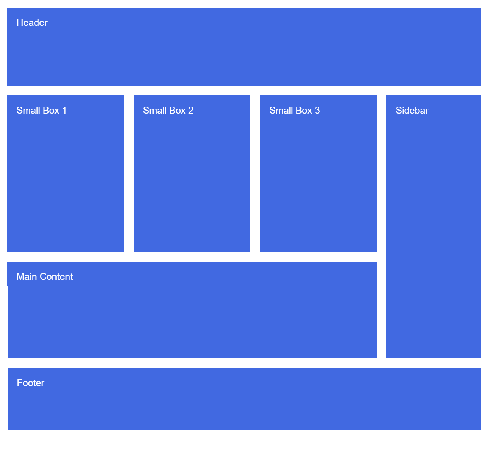

Clarusway

# Coding Challenge - 03 : CSS Grid

The goal of this coding challenge is to create a responsive CSS grid layout, mimicking the provided design.

## Learning Outcomes

By completing this coding challenge, you will:

- Enhance your ability to analyze problems and apply programming knowledge for appropriate solutions.

- Demonstrate proficiency in utilizing algorithmic design principles, effectively employing functions.

   
## Problem Statement

- Write HTML and CSS code to generate a CSS grid layout resembling the following design:

* Functionally, the grid should be similar to the example provided [here.](https://codepen.io/AaronClarusway/full/wvGpaXP)

- If you see the pic above, you will see 1 header, 3 small box, 1 sidebar image,1 main content,and 1 footer.

- Your HTML and CSS code should effectively replicate this structure and styling.

<strong> ⌛ Good luck, and enjoy coding!  ✍</strong> 

